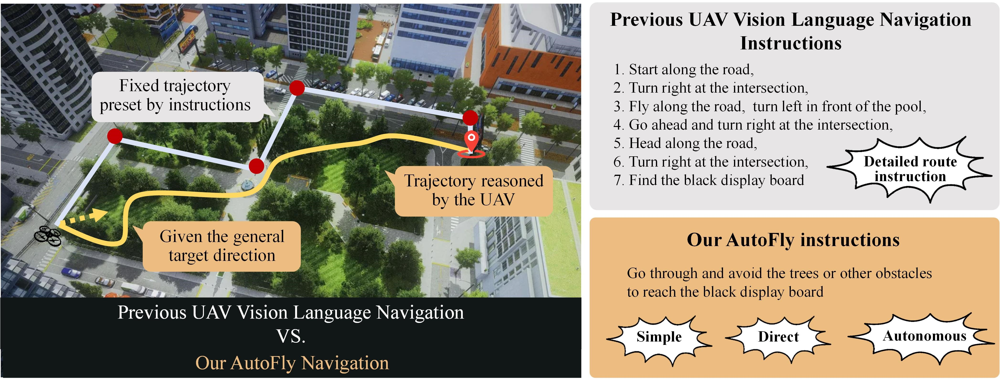

# AutoFly: Vision-Language-Action Model for UAV Autonomous Navigation in the Wild

[](https://iclr.cc/virtual/2026/poster/10011229)
[](https://xiaolousun.github.io/AutoFly/)
[](https://arxiv.org/abs/2602.09657)
[](https://www.modelscope.cn/datasets/jacksun001/autofly_dataset_tfds)
[](#release-plan)


This is the official repository for **AutoFly**, an end-to-end Vision-Language-Action (VLA) model for UAV autonomous navigation in the wild.

AutoFly takes RGB observations, concise natural-language instructions as input, then predicts executable UAV velocity commands for autonomous planning, obstacle avoidance, and target recognition.

> **TL;DR:** AutoFly shifts UAV vision-language navigation from detailed route following to autonomous decision-making with minimal guidance, using pseudo-depth spatial reasoning, large-scale multimodal navigation data, and progressive VLA training.

<p align="center">
  
</p>

## 📢 News

- **[2026.09.08]** 🚀 Our dataset is now open-sourced on ModelScope: [`jacksun001/autofly_dataset_tfds`](https://www.modelscope.cn/datasets/jacksun001/autofly_dataset_tfds)! The training, testing, and deployment code are being actively prepared and will be released soon. Stay tuned!

## Release Status

We are preparing the code, data processing tools, evaluation scripts, and deployment acceleration modules for a staged public release. This repository will be updated step by step to make each part easy to verify and reuse.

| Component | Status | Description |
| --- | --- | --- |
| Paper README | Released | Project overview, method summary, results, and release roadmap. |
| `assert` | Preparing | Figures, videos, demo assets, and visual examples. |
| `train` | Preparing | Data preparation, model initialization, pseudo-depth alignment, and VLA fine-tuning code. |
| `val` | Preparing | Simulation evaluation, real-world validation, metrics, and result reproduction scripts. |
| `acceleration` | External release | TensorRT/ONNX acceleration and deployment code will be maintained in a separate GitHub repository. |

## Release Plan

- [x] **Step 1: Paper repository setup**
  - Add project README.
  - Summarize paper contributions, results, and repository structure.

- [ ] **Step 2: Training code**
  - Release data preprocessing scripts.
  - Release pseudo-depth feature generation and alignment modules.
  - Release VLA fine-tuning scripts and configuration files.
  - Provide minimal training and debugging examples.

- [ ] **Step 3: Validation code**
  - Release simulation evaluation scripts.
  - Release seen/unseen scene and seen/unseen target evaluation protocol.
  - Release metric computation for Success Rate, Collision Rate, and Path Efficiency Rate.
  - Add real-world validation notes and hardware assumptions.

- [ ] **Step 4: Acceleration and deployment**
  - Link the external acceleration repository.
  - Provide ONNX/TensorRT conversion tools.
  - Release multi-process parallel inference pipeline.
  - Add LAN-based UAV deployment instructions.

## Method Overview

AutoFly formulates UAV autonomous navigation as:

```text
RGB observation + language instruction -> UAV velocity action
```

The model contains three main components:

1. **Vision-Language Model:** a VLA backbone for multimodal scene understanding and instruction grounding.
2. **Pseudo-Depth Encoder:** a monocular RGB-based depth-aware encoder that improves spatial reasoning without requiring onboard depth input.
3. **Action De-tokenizer:** a token-to-action module that maps model predictions to continuous UAV velocity commands.

AutoFly is trained with a progressive two-stage strategy:

1. **Vision-language alignment:** initialize multimodal representations from a strong VLM backbone.
2. **Spatially-informed action fine-tuning:** jointly align RGB, pseudo-depth, language, and robot actions for autonomous UAV navigation.

## Repository Structure

The final open-source repository will be organized as follows:

```text
AutoFly/
├── assert/        # Figures, videos, demos, and README assets
├── train/         # Training pipeline and model fine-tuning code
├── val/           # Evaluation and validation scripts
└── acceleration/  # Pointer to the external acceleration repository
```

| Module | Planned Contents |
| --- | --- |
| `assert` | Paper figures, framework diagrams, demo videos, qualitative results, and project-page assets. |
| `train` | Dataset preprocessing, pseudo-depth generation, depth-vision-language alignment, VLA fine-tuning, and training configs. |
| `val` | Simulation evaluation, real-world validation, metric calculation, and benchmark reproduction scripts. |
| `acceleration` | External acceleration and deployment repository. Replace this placeholder with the final GitHub link. |

## Dataset

AutoFly is trained on a multimodal autonomous navigation dataset designed for UAV decision-making rather than step-by-step route instruction following.

Each training sample follows the format:

```text
observation, language instruction, UAV state, action
```

Dataset statistics reported in the paper:

| Item | Scale |
| --- | ---: |
| Training episodes | 13K+ |
| Image-language-action triplets | 2.5M+ |
| Simulated scenes | 12 |

The dataset is now available on ModelScope: [`jacksun001/autofly_dataset_tfds`](https://www.modelscope.cn/datasets/jacksun001/autofly_dataset_tfds). Detailed data loading instructions, file format, and preprocessing scripts will be added during **Step 2**.

## Training

Training code will be released in `train/`.

Planned training modules:

- VLA backbone initialization.
- Pseudo-depth generation with monocular RGB input.
- Depth projector and depth-vision-language alignment.
- Robot action tokenization and de-tokenization.
- Spatially-informed action fine-tuning.

## Validation

Evaluation code will be released in `val/`.

The environment and related assets will be stored in Docker and release

## Acceleration and Deployment

The acceleration module will be released separately because deployment depends on TensorRT, ONNX export, custom CUDA operators, and UAV-side communication utilities.

Planned external repository:

The deployment system described in the paper uses:

- ONNX export for modular model components.
- TensorRT acceleration for LLM inference.
- Custom CUDA operators for depth processing.
- Multi-process parallel inference for overlapping visual encoding and LLM decoding.
- LAN communication between the UAV and remote inference server.


## Citation

If you find AutoFly useful for your research, please consider citing:

```bibtex
@article{sun2026autofly,
    title={AutoFly: Vision-Language-Action Model for UAV Autonomous Navigation in the Wild},
    author={Sun, Xiaolou and Si, Wufei and Ni, Wenhui and Li, Yuntian and Wu, Dongming and Xie, Fei and Guan, Runwei and Xu, He-Yang and Ding, Henghui and Wu, Yuan and others},
    journal={arXiv preprint arXiv:2602.09657},
    year={2026}
      }
```

## Acknowledgements

This project builds on prior work and open-source tools from the broader embodied AI, UAV autonomy, and robot learning communities. We especially thank the following projects:

- [Depth Anything V2](https://github.com/DepthAnything/Depth-Anything-V2) for monocular depth estimation.
- [Prismatic VLMs](https://github.com/TRI-ML/prismatic-vlms) for the vision-language model training framework.
- [OpenVLA](https://github.com/openvla/openvla) for open-source vision-language-action modeling.
- [AirSim](https://github.com/microsoft/AirSim) for UAV simulation and data collection.
- [NVIDIA TensorRT](https://docs.nvidia.com/deeplearning/tensorrt/latest/) and [TensorRT OSS](https://github.com/NVIDIA/TensorRT) for high-performance model deployment.
- The vision-language navigation and embodied AI community for foundational datasets, benchmarks, and evaluation protocols.
